## Проект API автотестов на тестовый магазин shop.bugred
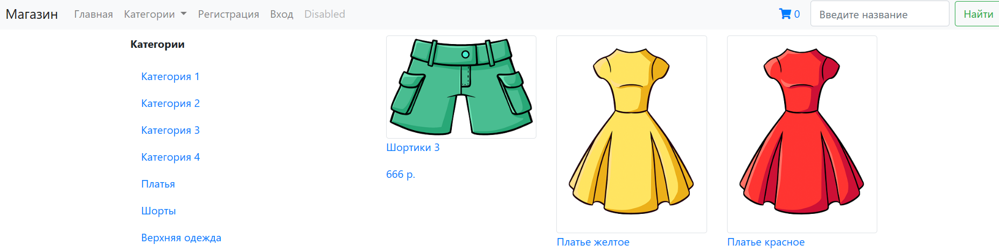

<h3> Список реализованных проверок:</h3>

* Создание товара
* Получение информации по созданному товару с помощью ID
* Обновление информации по созданному товару с помощью ID
* Поиск карточек товара
* Удаление созданного товар с помощью ID
  
----
### Используется:
<p  align="center">
  <code></code>
  <code></code>
  <code></code>
  <code></code>
  <code></code>
  <code></code>
  <code></code>
  <code></code>
  <code></code>
</p>

----
### Локальный запуск

> Для локального запуска необходимо выполнить команду в СLI:
```bash
python -m venv .venv
source .venv/bin/activate
pip install -r requirements.txt
pytest tests/
```

> Получение Allure отчета
```bash
allure serve allure-results/
```

----
###  Запуск проекта в Jenkins

### [Jenkins](https://jenkins.autotests.cloud/job/python_project_okko.tv/)

#### При нажатии на "Build with Parameters" начнется сборка тестов и их прохождение, через виртуальную машину в Selenide
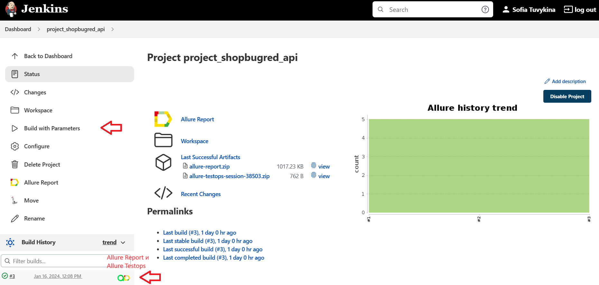

<!-- Allure report -->

###  Allure report
### [Report](https://jenkins.autotests.cloud/job/python_project_okko.tv/18/allure/)
#### Результаты тестов в Allure отчете
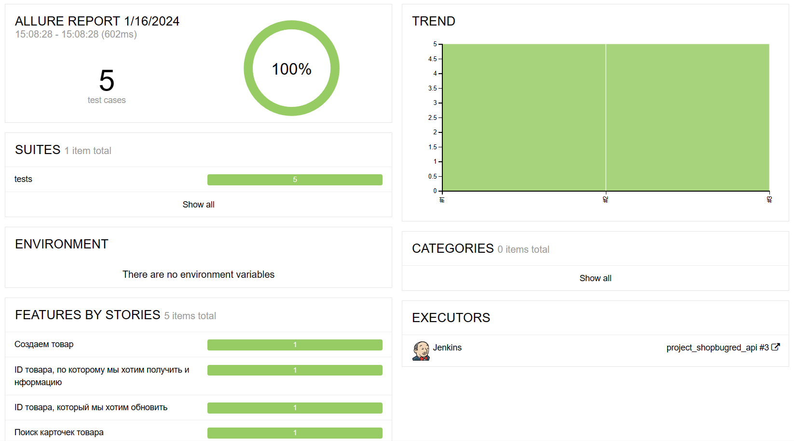

#### Список тест кейсов
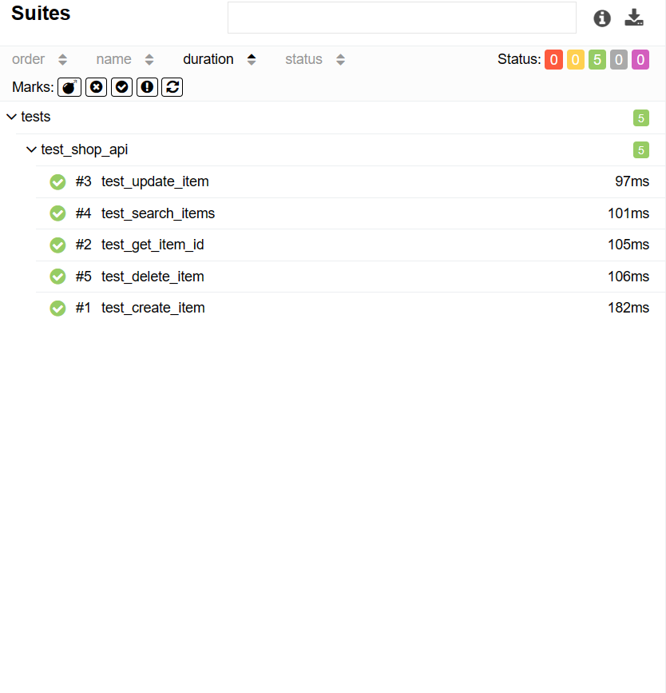

#### Пример отчета о прохождении api-теста
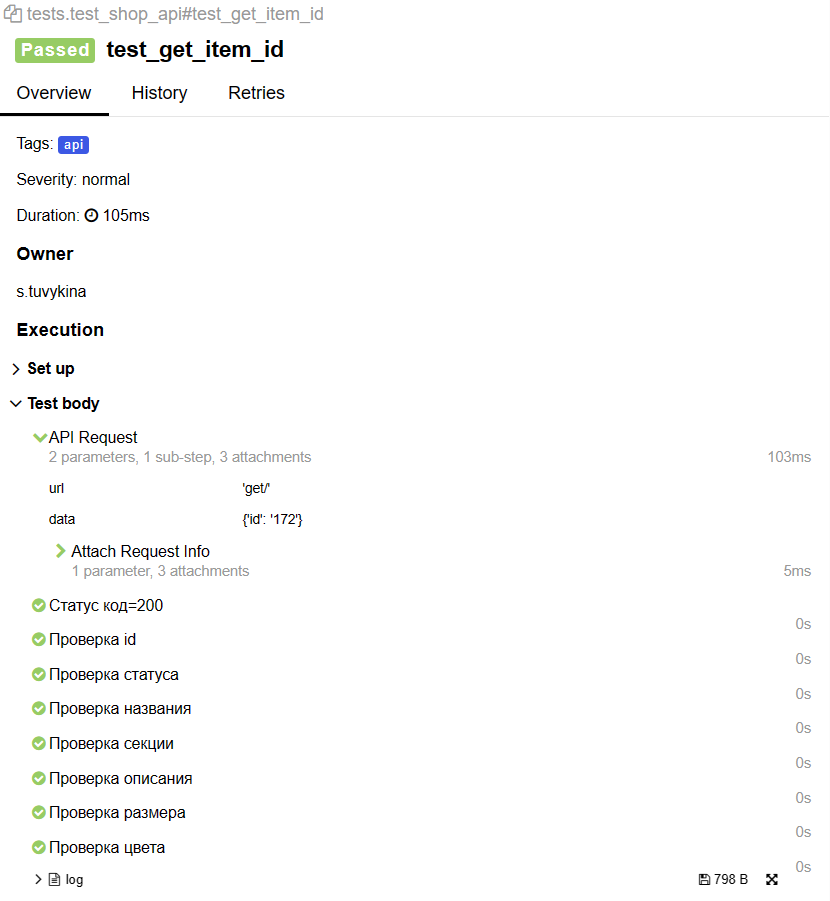

<!-- Allure TestOps -->

###  Allure TestOps

### [Dashboard](https://allure.autotests.cloud/project/3979/dashboards)

#### Dashboard с результатами тестирования
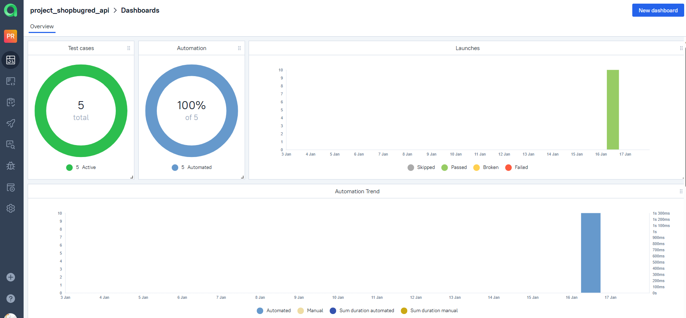

#### Список общих тестов
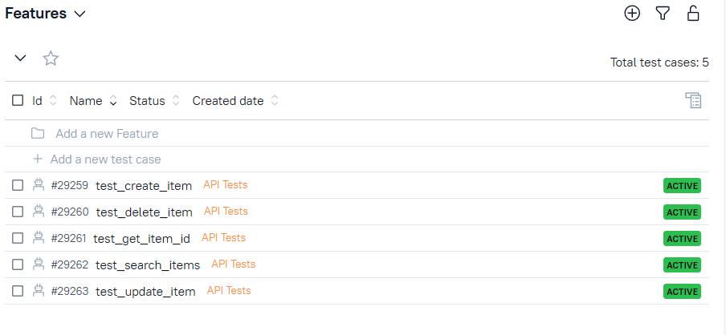

#### Пример отчета 
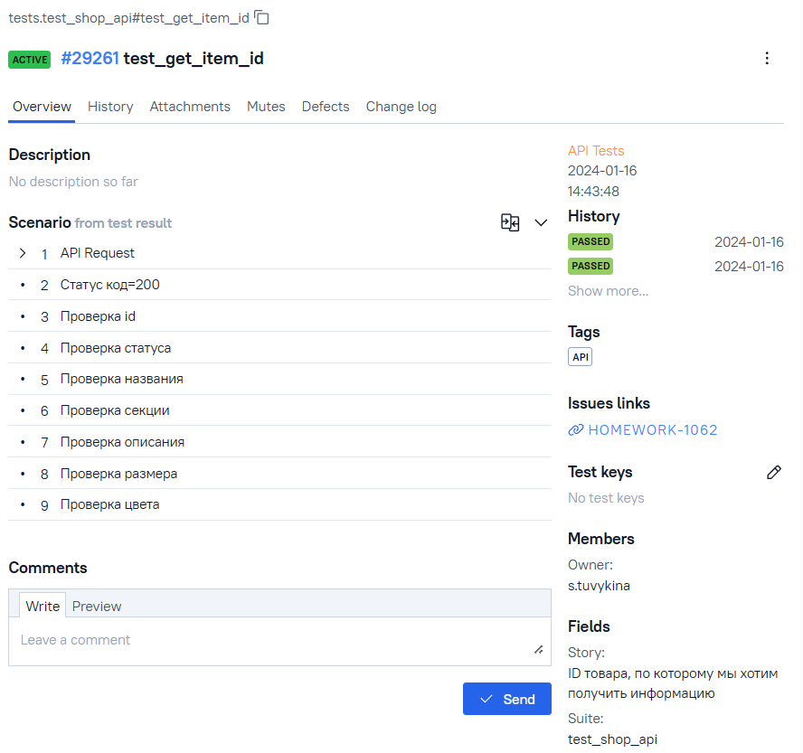

#### История запуска тестовых наборов
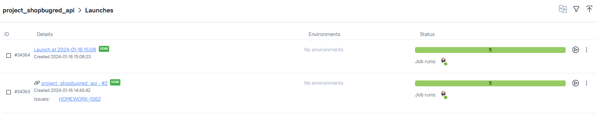

<!-- Jira -->

###  Jira

### [Jira](https://jira.autotests.cloud/browse/HOMEWORK-1062)

##### Настроенная через Allure TestOps интеграция с Jira

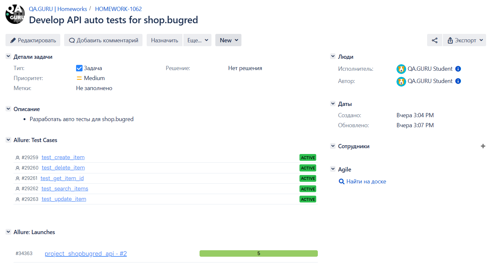

<!-- Telegram -->

###  Telegram

##### Уведовление в Telegram bot после прохождения тестов

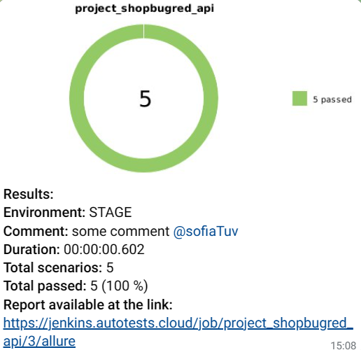


